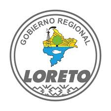
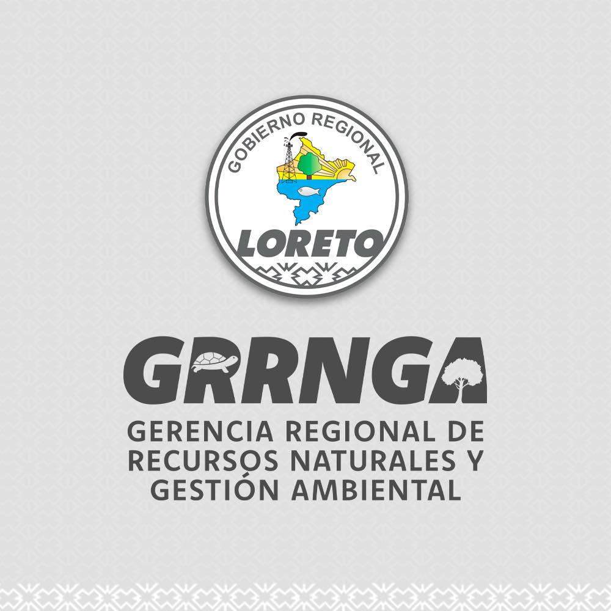
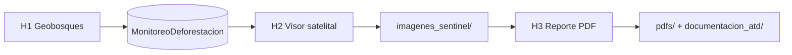

<p align="center">
  
  &nbsp;&nbsp;&nbsp;&nbsp;
  
  &nbsp;&nbsp;&nbsp;&nbsp;
  
</p>

<p align="center">
  
  &nbsp;&nbsp;&nbsp;
  
</p>

<h1 align="center">ATD Toolbox — Loreto</h1>

<p align="center">
  <strong>Alertas Tempranas de Deforestación</strong> en Áreas de Conservación Regional<br/>
  <em>GFP Subnacional · Suiza apoyando al Perú</em>
</p>

<p align="center">
  <a href="#demo-5-minutos">Demo 5 minutos</a> ·
  <a href="#inicio-rápido">Inicio rápido</a> ·
  <a href="guia/GUIA_ATD_LORETO.html">Guía completa</a> ·
  <a href="docs/EJEMPLO_reporte_ATD_Loreto.pdf">PDF de ejemplo</a>
</p>

---

## ¿Qué es este repositorio?

Paquete **listo para ArcGIS Pro** que automatiza el flujo institucional ATD en Loreto:

| Herramienta | Nombre | Qué hace |
|:-----------:|--------|----------|
| **H1** | Descarga Geobosques | Inserta alertas 2026 en `MonitoreoDeforestacion` |
| **H2** | Visor satelital | Fotointerpretación antes/después (Planet, Sentinel-2, Landsat) |
| **H3** | Reporte PDF | Diagnóstico + informe oficial con mapas, imágenes y vector de alerta |

Incluye **geodatabases de línea base**, logos institucionales, guía HTML y un **ejemplo de reporte** para capacitación.

### ACR incluidas

| Código | Área de Conservación Regional |
|--------|------------------------------|
| ACR09 | Ampiyacu Apayacu |
| ACR04 | Comunal Tamshiyacu Tahuayo |
| ACR17 | Maijuna Kichwa |
| ACR10 | Alto Nanay Pintuyacu Chambira |

---

## Demo 5 minutos

Flujo mínimo para probar el paquete como **demo** (sin descargar Geobosques):

```
1. Abrir ArcGIS Pro → agregar toolbox/ (H1, H2, H3)
2. Cargar GDB/Linea_base_deforestación_Loreto.gdb
3. H2 → MonitoreoDeforestacion → seleccionar 1 alerta → visor satelital
4. H3 → Diagnóstico Pre-Vuelo → Generar Reporte ATD
5. Abrir docs/EJEMPLO_reporte_ATD_Loreto.pdf para ver el resultado esperado
```



> **Taller completo:** ejecutar H1 primero para cargar alertas 2026 desde Geobosques.

---

## Inicio rápido

### Requisitos

- **ArcGIS Pro 3.x**
- Python `arcgispro-py3` con: `geopandas` `fiona` `pandas` `numpy` `matplotlib` `Pillow` `pyproj` `reportlab` `requests`

```bat
pip install geopandas fiona pandas numpy matplotlib Pillow pyproj reportlab requests
```

### Pasos

1. **Clone** este repositorio (o descargue ZIP).
2. Abra la carpeta **`ATD_Loreto/`** completa en ArcGIS Pro — no mueva solo el toolbox.
3. **Catalog → Toolboxes → Add Toolbox** → agregue los tres `.pyt` en `toolbox/`.
4. Ejecute **`DIAGNOSTICO_ENTORNO.bat`** (primera vez).
5. Lea la guía: [`guia/GUIA_ATD_LORETO.html`](guia/GUIA_ATD_LORETO.html).
6. En H3: **Diagnóstico Pre-Vuelo** → **Generar Reporte ATD**.

### Parámetros GDB (referencia)

| Parámetro | Valor |
|-----------|-------|
| GDB línea base | `GDB/Linea_base_deforestación_Loreto.gdb` |
| Alertas vigentes | `MonitoreoDeforestacion` |
| Histórico 2001–2025 | `MonitoreoDeforestacionAcumulado` |
| Gestión ACR | `GDB/GestionACR_16012024.gdb` |

---

## Estructura del paquete

```
ATD_Loreto/
├── README.md              ← Está leyendo esto
├── toolbox/               H1 · H2 · H3 + módulos Python
├── GDB/                   Línea base + gestión ACR
├── logos/                 Identidad visual (GFP, GORE, GRRNGA, ACR…)
├── guia/                  Guía HTML + solución de problemas
├── docs/                  PDF de ejemplo para demo
├── pdfs/                  Sus reportes generados (no se suben a git)
├── imagenes_sentinel/     Exportaciones del visor H2
├── mapas/                 Mapas de contexto
├── documentacion_atd/     HTML swipe y metodología
└── DIAGNOSTICO_ENTORNO.bat
```

---

## Características destacadas

- Visor satelital con **logos GFP** y exportación HD para el mapa activo
- Imágenes del PDF con **polígono rojo** de la alerta superpuesto
- Dominios y campos ATD alineados (`zona_influencia`, `md_exa`, `anp_codi`, WGS84)
- Modo estable en H3 si ArcGIS Pro se cierra al generar PDF → ver `guia/ATD_SI_SE_CIERRA_PRO.md`

---

## Soporte y créditos

| Recurso | Ubicación |
|---------|-----------|
| Guía Loreto | `guia/GUIA_ATD_LORETO.html` |
| Problemas con ArcGIS Pro | `guia/ATD_SI_SE_CIERRA_PRO.md` |
| Diagnóstico Python | `DIAGNOSTICO_ENTORNO.bat` |
| Reporte demo | `docs/EJEMPLO_reporte_ATD_Loreto.pdf` |

**GFP Subnacional** · Cooperación Suiza (SECO) · Basel Institute on Governance  
**Gobierno Regional de Loreto** · Gerencia Regional de Recursos Naturales y Gestión Ambiental

<p align="center">
  <sub>Versión 2026 · Uso institucional del equipo ATD Loreto</sub>
</p>
